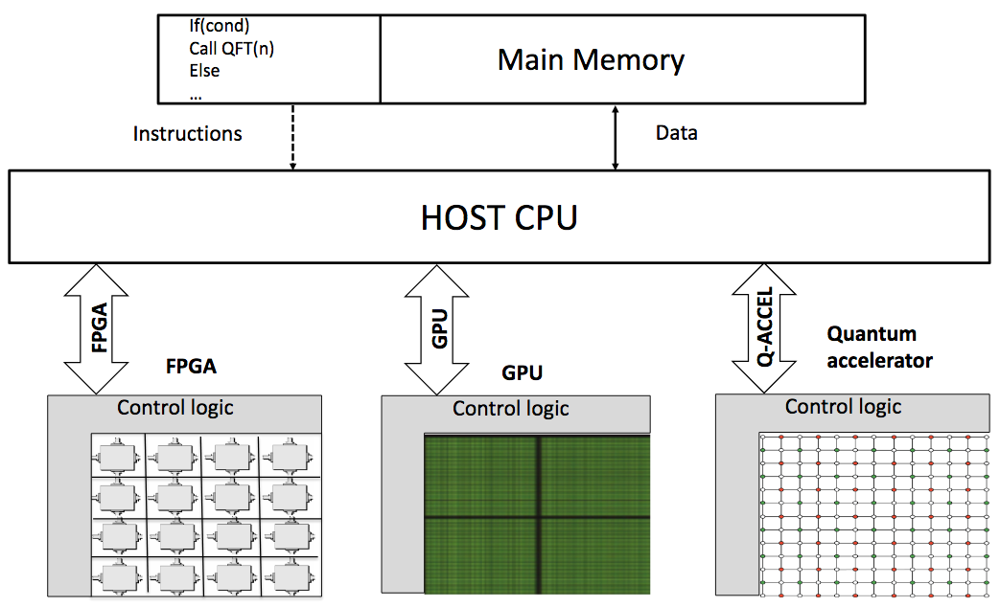
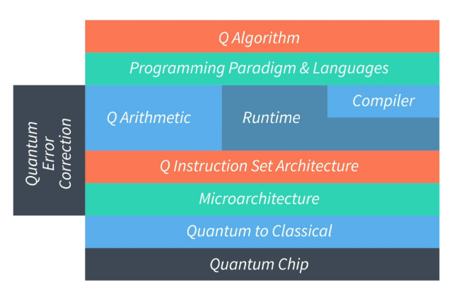

# Introducing the building blocks of a quantum computer

By the term **"Quantum Computer"** we don't mean an actual _computer_ but rather a classical computer with an extra component that is capable of doing quantum computations; the so called _quantum accelerator_. With this design, the computer is capable of doing both classical and quantum computations.

_Quantum accelerator_ is a computational devise that can be connected to a classical processor that will provide the performance for a series of applications that we can never reach classically.

Quantum computers are supposed to be a lot faster than classical computers for certain computations. It is good to understand that by '**fast**' we don't mean '_twice as fast_' or even '_100 times as fast_'. With the quantum speedup, we mean the difference between a **month** and the **lifetime of the universe**. So, computations that are **nowhere feasible on a classical computer**, suddenly become so on a quantum computer.

Here you see the global view of what we currently understand as a _heterogeneous_ multi-core architecture. Heterogeneous because we have different kind of accelerator technologies. We have an **FPGA** which stands for the field programmable gate array. We have **GPU**'s, for Graphic Programming Unit. These are the vector processors we are using to produce graphics computation. The third _alternative accelerator_ technology will be a **quantum co-processor** which has the quantum properties that will provide a substantial increase in the compute power.

Means that when you write any application, you will most likely end up using different kinds of accelerators including the FPGA, the GPU and also the quantum accelerator and therefore your application has to be compiled for four different instruction sets; namely, your Intel processor for instance on the classical machine, your FPGA instruction set, the GPU instruction set, and also the quantum instruction set.

1. **Quantum Algorithm:**

   - We don't even know yet what they will be. We have examples such as factorization that is used in cryptography in securing communication between machines as well as a new molecule for personalized medicine.
   - The biggest opportunity lies here, where many companies and organizations can start developing their own quantum applications. Because every company or every end-user can think of how they can use that computational aspects of such a quantum device

2. **Programming Language:**
   - Programming languages can produce the code for a classical processor. But we also have to develop our own quantum language for the quantum accelerator.
   - There are a couple of languages that have been developed so far. There is ScaffCC, and ProjectQ. QuTech are developing their own programming language called OpenQL
3. **Compiler:**
   - For every programming language we need a compiler. A compiler takes the input of your algorithmic logic and compiles it into a lower level language that is classically called an assembly language. Work is on a quantum assembly language which we call QASM.
4. **Quantum Arithmetic:**
   - The next layer is quantum arithmetic's because the mathematics of what you need to do is completely different than classically. The quantum gates operate quite differently, that's why you need to develop the quantum arithmetic; how to do a quantum operation.
5. **Q Instruction set:**
   - Quantum instruction set basically describes what the operations are that your quantum device is capable of executing. That is why we have to think of what these instructions are.
   - We know that classically we use an assignment like A = B + C. We should be able to do something similar in a quantum device.
   - But it is not as simple as retrieving data from a memory location and perform the addition and writing back the result, because in quantum we use qubits.
6. **Q Micro-architecture:**
   - Just like any classical processors we have also a quantum micro architecture for my quantum device, which contains the processor, the memory and also the interconnects of how the processor will communicate with the qubits. It has local registers in the processor and an ALU, an arithmetic logical unit so that it can compute logical and arithmetical operations, and write back the result to memory so that the user gets an idea of what the algorithm has computed as a result.
   - So in the quantum case we have a micro-architecture which has a similar kind of functionality. And that is the one we are also currently implementing in a real device that already controls a number of the physical qubits.
7. **Quantum to Classical:**
   - This layer is necessary for translating all of the logical steps that you need to do in your algorithm into the appropriate microwave or the physical signal that you want to send to this electron and to the qubit.
8. **Quantum Chip:**
   - Ultimately it enters into the quantum chip which consists of these qubits which are connected to each other. And then we hope of course that we get a meaningful result.
   - Now it is never the less important to understand for a quantum accelerator for any computational device is that it is a non-deterministic way of computing. That means that it is not like in a classical machine that you run a thousand times the same algorithm and you will get a thousand times exactly the same result.
   - Quantumly this is absolutely not true, because when you want to read out the result several things happen. The most important is that any entangled superposition that exists, actually is going to get destroyed.
   - So if I have for example 2^17 possibilities, I am only going to get one of those possibilities back as a result. And all the others will disappear. And that is why you maybe have to do a computation 10 times, a 100 times, we don't even know how many times we need to do that. And then you can make a histogram of what has been computed, and the readout that has the highest frequency of occurrence has a high probability of being read by our micro-architecture and that is what we can report back to the end user.
   - So that is something that you should not forget.
